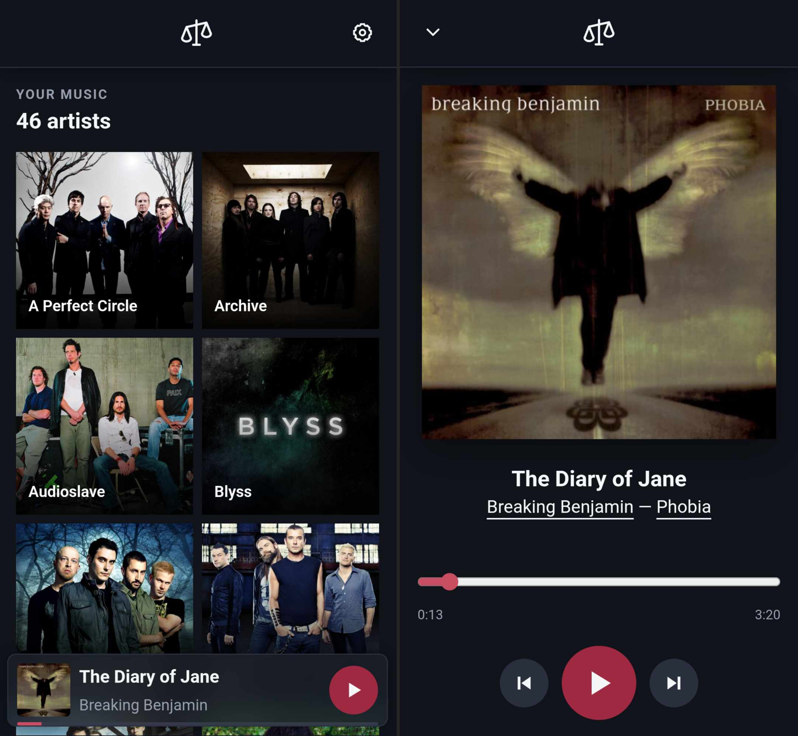

<h1> Libras</h1>

Libras is a browser-based music player that connects to your own music server. Browse your library, play music, and download tracks to take with you.

> Named after “3 Libras” by A Perfect Circle.

## Features

- Browse artists, albums, and tracks.
- Stream music from your own server.
- Download music for offline playback and manage it in Settings → Downloads.
- Restore your playback queue and position between sessions.
- Install as a standalone web app.

## Get started

1. Open [Libras](https://trysound.github.io/libras/).
2. Connect to your music server with your server address and credentials.
3. Browse your library and start listening.

Just trying it out? Connect to the [Navidrome demo server](https://demo.navidrome.org/) using `https://demo.navidrome.org` as the server address and `demo` as both the username and password.

You'll need a reachable **HTTPS server with a Subsonic-compatible API**, such as [Navidrome](https://www.navidrome.org/), configured to allow browser requests from `https://trysound.github.io` (CORS). Libras is a player, not a music hosting service; bring your own server and library.

## Install

You can use Libras in your browser or install it as a standalone web app:

- **iPhone/iPad:** Open in Safari, then choose **Share → Add to Home Screen**.
- **Android:** Choose **Install app / Add to home screen** from the browser menu.
- **Desktop:** Use the browser's install option, where available.

Installation options vary by browser and device. Offline storage and background playback have not yet been verified on iOS.

## Listen offline

Download music while online, then switch to **Offline Library** to listen without a connection.

- **Manage downloads:** Settings → Downloads.
- **Refresh library:** Automatic when opening online, or via Settings → Refresh library.
- **Disconnect:** Removes credentials but keeps saved music and your queue. Reconnect to leave offline mode; disconnect first to switch servers.
- **Storage:** Each server/account has its own offline library, saved only in this browser on this device. **Clearing site data deletes it.**

## App updates

A dot on Settings means an update is ready. Choose **Settings → Update now** to install it—this reloads the app and interrupts playback.

## Development

See [CONTRIBUTING.md](CONTRIBUTING.md) for local setup, checks, deployment, and storage architecture.

## License

[MIT](LICENSE) © 2026 Bogdan Chadkin.
